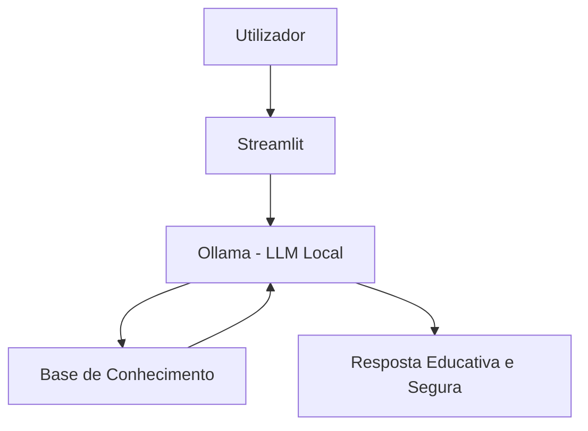

# 👩‍🏫 DenaFin - Educadora Financeira Inteligente

> Agente de IA Generativa desenhado para ensinar conceitos de finanças pessoais a jovens adultos, estudantes e trabalhadores independentes de forma simples, usando os próprios dados do cliente como exemplos práticos.

## 💡 O Que é a DenaFin?

A DenaFin é uma assistente virtual que atua como uma "Professora Particular". Ela **ensina**, não recomenda. Ela explica conceitos como reserva de emergência, gestão de rendimentos variáveis e tipos de investimentos usando uma abordagem didática, empática e com exemplos concretos baseados no extrato do cliente.

**O que a DenaFin faz:**
- ✅ Explica conceitos financeiros de forma simples e sem jargões
- ✅ Usa dados reais do utilizador (ex: rendimentos de estafeta, propinas) como exemplos práticos
- ✅ Lê o histórico de atendimento para retomar conversas pendentes
- ✅ Analisa padrões de gastos para promover a literacia financeira

**O que a DenaFin NÃO faz:**
- ❌ Não recomenda investimentos específicos (ex: "Compra esta ação")
- ❌ Não tem, nem pede, acesso a passwords, PINs ou cartões bancários
- ❌ Não envia dados para a cloud (funciona de forma 100% local)

## 🏗️ Arquitetura



**Stack Tecnológica:**

- **Interface:** Streamlit (Python)
    
- **LLM:** Ollama (Modelo local quantizado `hf.co/unsloth/gemma-4-12b-it-GGUF:UD-Q4_K_XL`)
    
- **Base de Dados:** Ficheiros JSON e CSV locais (Pandas)


## 📁 Estrutura do Projeto


```
├── data/                          # Base de conhecimento e mock data
│   ├── faq_educacao_financeira.json # Teoria e exemplos práticos
│   ├── transacoes.csv             # Histórico de gastos e rendimentos
│   ├── historico_atendimento.csv  # Memória de interações anteriores
│   └── produtos_financeiros.json  # Catálogo didático de produtos (ex: PPR, ETFs)
│
├── docs/                          # Documentação completa do sistema
│   ├── 01-documentacao-agente.md  # Caso de uso e persona
│   ├── 02-base-conhecimento.md    # Estratégia de RAG
│   ├── 03-prompts.md              # System prompt e Few-Shot exemplos
│   ├── 04-metricas.md             # Avaliação de qualidade e Guardrails
│   └── 05-pitch.md                # Guião de apresentação do projeto
│
└── src/
    └── app.py                     # Motor principal e interface Streamlit
```

## 🚀 Como Executar

### 1. Preparar o Servidor de IA (Ollama)

Certifica-te que tens o [Ollama](https://www.google.com/search?q=https://ollama.com) instalado no teu sistema operativo (seja Linux/Zorin OS ou Windows). Abre o terminal e executa:


```
ollama pull hf.co/unsloth/gemma-4-12b-it-GGUF:UD-Q4_K_XL
ollama serve
```

### 2. Instalar as Dependências do Python

No teu ambiente virtual (`.venv`), instala as bibliotecas necessárias:


```
pip install streamlit pandas requests
```

### 3. Rodar a DenaFin

Garante que estás na diretoria raiz do teu projeto e executa:


```
streamlit run src/app.py
```

## 🎯 Exemplos de Uso

**Pergunta:** "DenaFin, o que são Certificados de Aforro?"

**DenaFin:** "Um Certificado de Aforro é um produto de Renda Fixa (Dívida Pública) com risco muito baixo, pois o capital é garantido pelo Estado. O aporte mínimo é de apenas 100€! É excelente para construíres a tua reserva de emergência e guardares o dinheiro que ganhaste nas tuas entregas de forma segura."

**Pergunta:** "Onde é que eu gastei mais dinheiro em Junho?"

**DenaFin:** "A analisar as tuas transações... O teu maior investimento este mês foi em Educação (119,00€), com as propinas do ISEC e o módulo de Formação TVDE. Logo a seguir vem a Alimentação (113,10€). Investir no teu futuro é a melhor escolha! Queres ver algumas estratégias para otimizar os teus custos variáveis de transporte?"

## 📊 Métricas de Avaliação

|**Métrica**|**Objetivo**|
|---|---|
|**Assertividade (RAG)**|O agente extrai as somas e conceitos corretos dos ficheiros CSV/JSON locais?|
|**Segurança (Guardrails)**|Evita inventar regras e recusa terminantemente dar conselhos financeiros diretos?|
|**Coerência (Persona)**|A linguagem é empática, pedagógica e adequada a um jovem adulto/estudante?|

## 🎬 Diferenciais do Projeto

- **Privacidade Absoluta (100% Local):** Arquitetura desenhada para correr estritamente offline usando o Ollama. Nenhum dado financeiro do utilizador é enviado para APIs de terceiros.
    
- **Contexto de Rendimentos Variáveis:** Lógica de negócio focada num público moderno (trabalhadores independentes/gig economy), ensinando a criar um "Fundo de Maneio" e não apenas um orçamento padrão.
    
- **Engenharia de Prompt Avançada:** Utilização de _Few-Shot Prompting_ e injeção de contexto estruturada para bloquear alucinações teóricas do modelo LLM.
    

## 📝 Documentação Completa

Toda a documentação técnica, estratégias de prompt, edge cases e testes de stress estão detalhados e disponíveis na pasta [`docs/`](https://www.google.com/search?q=./docs/).
